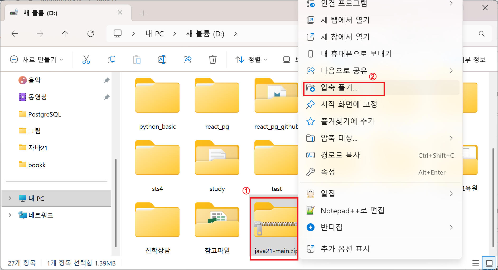
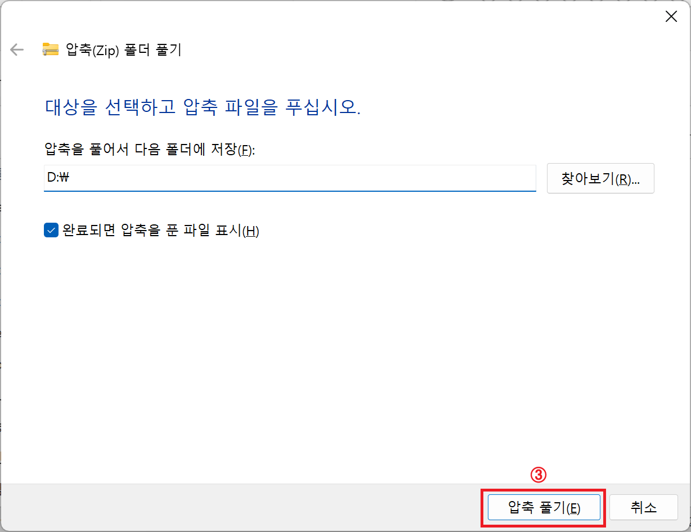
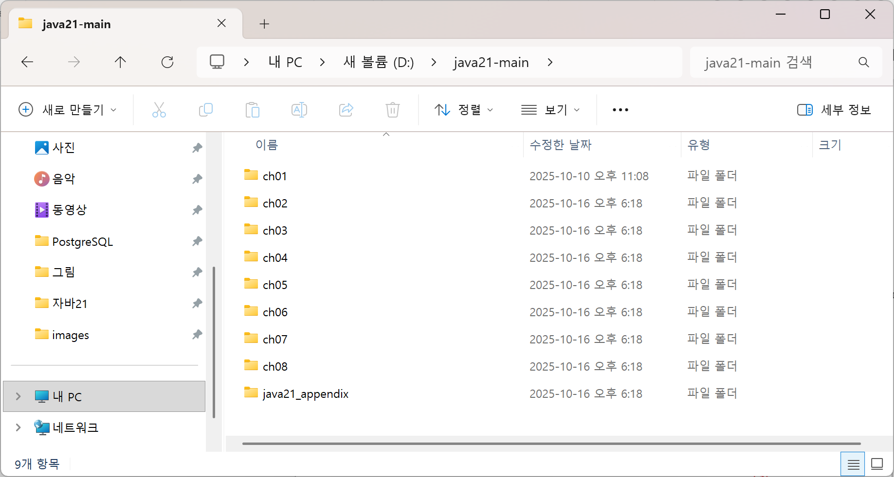
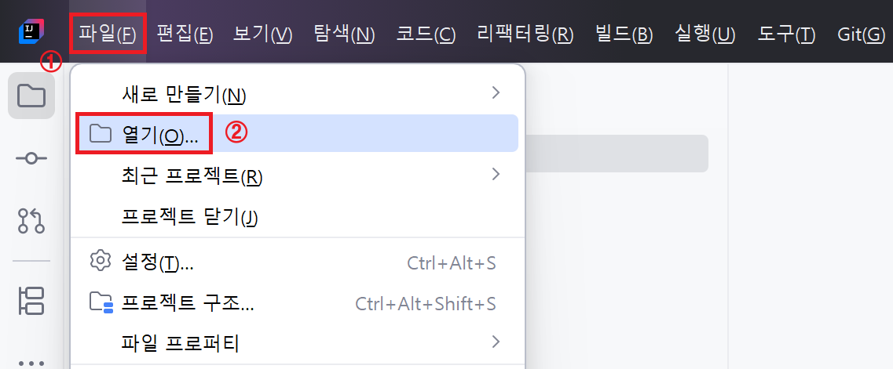
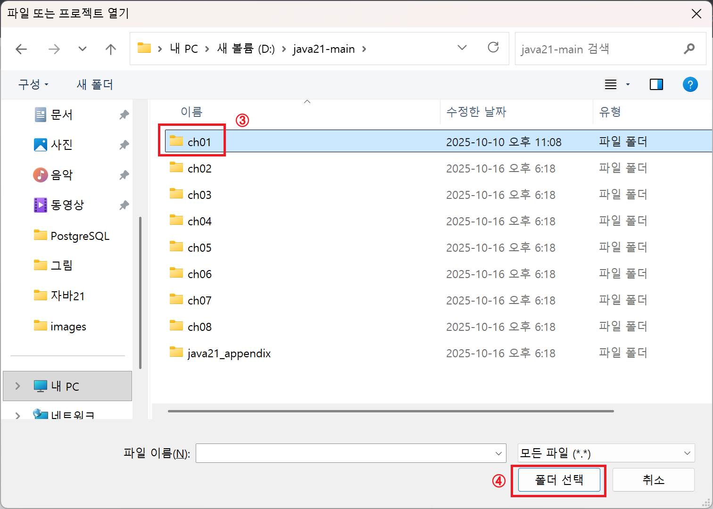
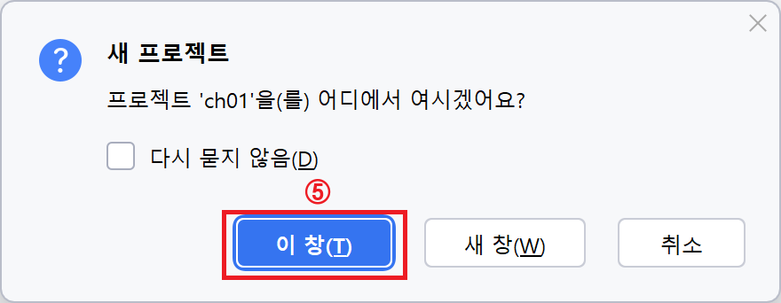
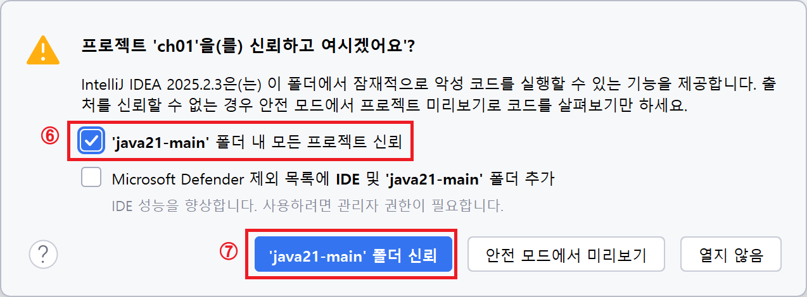
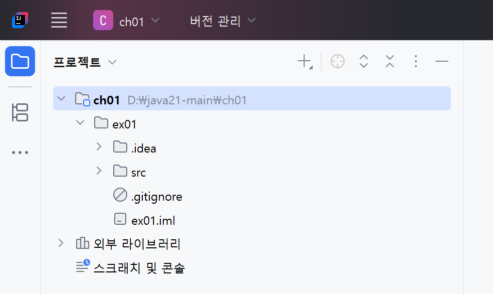

## 1. 소스 다운로드

아래 다운로드 링크를 클릭하세요

다운로드 링크: https://github.com/gitaidev1004/java21/archive/refs/heads/main.zip

  

## 2. 압축 풀기

① 다운로드 받은 폴더에서 마우스 오른쪽 버튼을 누릅니다.
② 오른쪽 버튼을 눌렀을 때 나오는 메뉴에서 [압축풀기...] 메뉴를 선택합니다.

 

③ 폴더 저장 위치를 "C:\"나 "D:\"와 같이 본인이 원하는 위치로 지정한 후 [압축 풀기] 버튼을 누릅니다.

 

압축이 해제되면, 아래와 같이 결과가 나타납니다.

  

## 3. 프로젝트 열기

① 인텔리제이에서 [파일] 메뉴를 선택합니다.

② [파일] 메뉴의 하위 메뉴인 [열기]를 선택합니다.

 

③ 열고 싶은 프로젝트를 선택합니다.

④ 원하는 폴더를 선택하였다면, [폴더 선택] 버튼을 누릅니다.

 

⑤ 새 프로젝트를 열 때 어떤 창에 열겠는지 묻는 창이 열리면, [이 창(T)] 버튼을 누릅니다.

 

⑥ 경고창이 뜨면 "java21-main 폴더 내 모든 프로젝트 신뢰" 항목의 체크박스를 체크합니다.

⑦ ['java21-main' 폴더 신뢰] 버튼을 누릅니다.

 

정상적으로 작업하였다면, 아래 그림과 같이 프로젝트가 열립니다.

  

